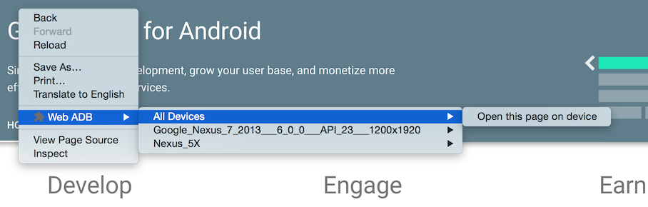

# web-adb

A Chrome extension and accompanying native adb proxy for working with Android devices
over the Android Debug Bridge.

This project is experimental and likely to change.

## Installation

There are two steps to installing the extension.

First, install the extension itself:

1. Go to chrome://extensions
2. Enable Developer Mode
3. Click "Load unpacked extension…" and select the `chrome-extension` subdirectory
4. Copy the extension ID (looks like `fjjafbbfkohceghfmdelplodgaohmope`)

Then, install the native host from the command line:

1. First build the binary: `go build native-host/web-adb.go`
2. Optionally, move the new `web-adb` binary file to your bin directory.
3. Then install the manifest: `./web-adb -install -extension-id fjjafbbfkohceghfmdelplodgaohmope`

Finally, reload the extension to connect to the native host.
